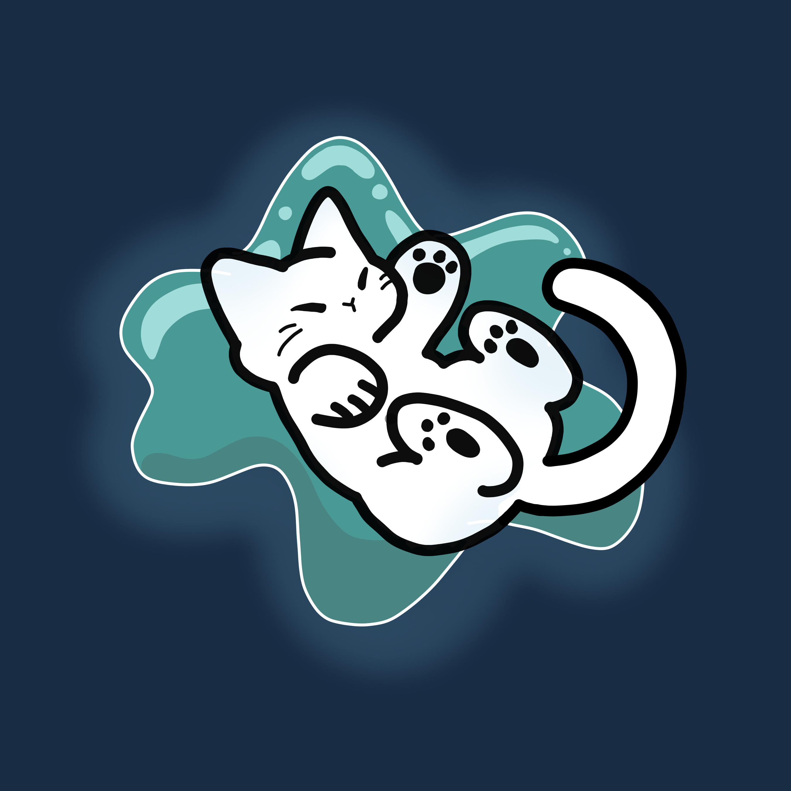

# Welcome to the Docs!

### **Welcome to the Soltide docs👋!**

<figure><figcaption></figcaption></figure>

### What is Soltide?

Soltide is a Minecraft S.M.P. server with a strong focus on grinding and combat! Featuring custom items, custom enchants, and a battle arena, you're sure to have a good time! 

### How do I join?

See the information on how to join Soltide [here](tutorials/how-to-join.md). Please note that Soltide does not support "cracked" / pirated accounts.

### What are the rules?

See the rules [here](info/rules/). Make sure to read the rules in entirety before playing to prevent punishments!&#x20;

### How do I become a staff member?

View information on becoming a staff member [here](info/staff.md)!

### How can I contact the staff team?

You can learn more about contacting the staff team for support [here](important/support.md)!

